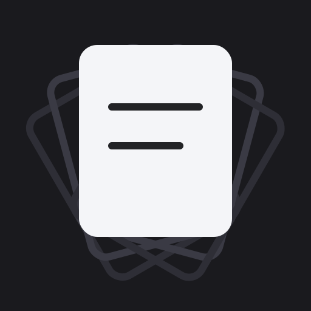
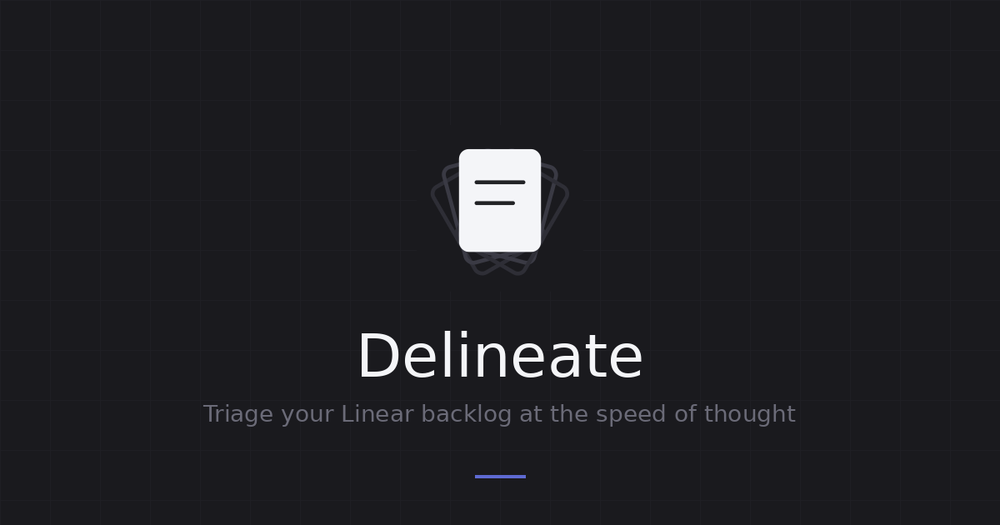

<p align="center">
  
</p>

<h1 align="center">Delineate</h1>

<p align="center">
  <strong>Triage your Linear backlog at the speed of thought.</strong>
</p>

<p align="center">
  <a href="https://delineate.mriziq.com">Live App</a> &middot;
  <a href="#quick-start">Self-Host</a> &middot;
  <a href="https://github.com/mriziq/delineate/issues">Report a Bug</a>
</p>

<p align="center">
  <a href="https://github.com/mriziq/delineate/stargazers"></a>
  <a href="https://github.com/mriziq/delineate"></a>
  <a href="https://github.com/mriziq/delineate/issues"></a>
  <a href="https://github.com/mriziq/delineate/blob/main/LICENSE"></a>
</p>

<p align="center">
  
</p>

---

## Why

Linear is great for project management, but triaging a large backlog in it can be slow. Keyboard shortcuts conflict or misfire (try pressing <kbd>G</kbd> then <kbd>S</kbd> to go to settings), bulk editing is clunky, and there's no dedicated "work through the pile" mode.

Delineate fixes that. It's a **Tinder-meets-Superhuman** interface for your Linear issues: sign in with your Linear account, and every untriaged issue is presented as a card. Swipe through them one by one, assigning priority, estimate, labels, project, and assignee with just your keyboard. When you're done, commit all your changes in a single batch. Inbox zero for your backlog.

## Features

- **Swipe-card UI** — issues appear one at a time, keeping you focused on the decision at hand
- **Keyboard-first** — set priority, estimate, labels, assignee, and project without touching the mouse
- **Batch commit** — stage changes across dozens of issues, then push them all to Linear at once
- **Linear OAuth** — sign in with your existing Linear account, no API keys to manage
- **Fast & lightweight** — React + Vite frontend, minimal Express backend

## Try It

Delineate is live at **[delineate.mriziq.com](https://delineate.mriziq.com)**. Sign in with Linear and start triaging.

## Quick Start

Want to self-host or develop locally? Follow the steps below.

### 1. Create a Linear OAuth App

Go to **Linear Settings > API > OAuth Applications > New OAuth Application**.

- **Name**: Delineate (or whatever you like)
- **Redirect URI**: `http://localhost:5173/auth/callback` (local dev) or `https://yourdomain.com/auth/callback` (production)

You'll get a **Client ID** and **Client Secret**.

### 2. Configure Environment

Create a `.env` file in the project root:

```env
LINEAR_CLIENT_ID=your_client_id
LINEAR_CLIENT_SECRET=your_client_secret
SESSION_SECRET=your_random_secret    # generate with: openssl rand -hex 32
APP_URL=http://localhost:5173
```

<details>
<summary>All environment variables</summary>

| Variable | Description |
|---|---|
| `LINEAR_CLIENT_ID` | OAuth Client ID from Linear |
| `LINEAR_CLIENT_SECRET` | OAuth Client Secret from Linear |
| `SESSION_SECRET` | Random string for signing session cookies |
| `APP_URL` | Public URL of the app (`http://localhost:5173` for dev) |
| `PORT` | *(Optional)* Port for the Express server. Defaults to `3000` |
| `NODE_ENV` | *(Optional)* Set to `production` for HTTPS redirect, secure cookies, and CSP headers |

</details>

### 3. Install & Run

```bash
npm install
npm run dev
```

This starts both the Express backend (port 3000) and Vite frontend (port 5173). Open [http://localhost:5173](http://localhost:5173).

## Production

```bash
npm run build
npm start
```

Builds the frontend and serves everything from a single Express process. Set `NODE_ENV=production`, `APP_URL=https://yourdomain.com`, and your OAuth credentials as environment variables.

Make sure your Linear OAuth app's redirect URI includes `https://yourdomain.com/auth/callback`.

## Scripts

| Command | Description |
|---|---|
| `npm run dev` | Start backend + frontend for local development |
| `npm run dev:server` | Start only the Express backend |
| `npm run dev:client` | Start only the Vite frontend |
| `npm run build` | Type-check and build the frontend to `dist/` |
| `npm start` | Start the production server |
| `npm run lint` | Run ESLint |

## Tech Stack

- **Frontend** — React 19, TypeScript, Vite
- **Backend** — Express 5, cookie-session
- **Auth** — Linear OAuth 2.0
- **Security** — Helmet, rate limiting, CSP headers

## Contributing

Contributions are welcome! Please open an issue first to discuss what you'd like to change.

## Author

Created by [@mriziq](https://github.com/mriziq).

## License

MIT
